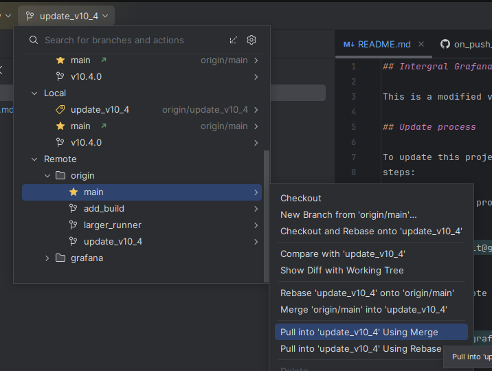

## Intergral Grafana

This is a modified version of Grafana used by Intergral on FusionReactor Cloud platform.

## Update process

To update this project when a new version of [Grafana](https://github.com/grafana/grafana) is released follow these
steps:

1. CheckOut this project locally

```bash
  git checkout git@github.com:intergral/grafana.git
```

2. Add a new remote for the upstream [grafana/grafana](https://github.com/grafana/grafana) project

```bash
 git remote add grafana git@github.com:grafana/grafana.git
```

3. Fetch the upstream tags etc

```bash
git fetch grafana
```

4. Create a new branch for the new update

```bash
git checkout -b update_v10_4 tags/v10.4.1
```

5. Push branch to create PR

```bash
git push -u orign updaate_v10_4
```

6. Create PR in Github
7. ReMerge our changes from origin/main - (I recommend using IDE to perform this action)

```bash
git pull origin main --no-rebase
```



It will be necessary to manually resolve the conflicts.

The above steps will create a new branch with a PR with all the changes from the old version to the new version. It is
then necessary to check for custom changes on the main branch made by us.

## Known changes

Below are some changes that we have made for this project vs [grafana/grafana](https://github.com/grafana/grafana)

### Build

The build workflows have been re worked to support our needs when updating do not accept any changes from upstream.

### Development

#### Go

There is a run config for idea `Run Server with Debug` that will run Grafana server with debug attached.

#### UI

To run the UI run `yarn run dev`. This will run the UI in dev mode listening for updates.

As this project is large running both can be bothersome. So if you are not working on the UI try to just run the
build: `yarn run build`.

#### Testing Auth Proxy

To run grafana as it will be deployed for FR run with ngrok:

This will provide a URL you can use to 'login' to grafana running on `localhost:3000` and will appear as it would on FR.

```bash
ngrok http 3000 --request-header-add="X-WEBAUTH-USER: <FR_USERNAME>" --request-header-add="X-WEBAUTH-EMAIL: <FR_EMAIL>" --request-header-add="X-WEBAUTH-ORG: <FR_TENANT_ID>"
```

## License

Grafana is distributed under [AGPL-3.0-only](LICENSE). For Apache-2.0 exceptions,
see [LICENSING.md](https://github.com/grafana/grafana/blob/HEAD/LICENSING.md).
